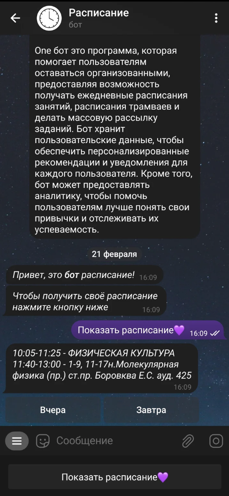

<h1>Telegram One Bot 🤖</h1>

Welcome to the One! This bot is designed to make managing your schedule a breeze.

<h2>Features</h2>
<ul style="font-size: 20px">
    <li>📚 Receive schedules for classes, exams, and tests directly on Telegram.</li>
    <li>⏰ Schedule notifications to be sent 15 minutes before the next event, ensuring you never miss an important session.</li>
    <li>🔄 Easily update your schedule by sending new event details to the bot.</li>
    <li>👩‍🏫 Support from a curator: Ask questions and receive answers directly in the chat with the bot from a designated curator.</li>
    <li>🤖 Seamless integration with Telegram, making it accessible and convenient for users.</li>
</ul>

<h2>Benefits</h2>
<ul style="font-size: 20px">
    <li>🚀 Simplifies schedule management: No need to juggle multiple apps or platforms. Get all your schedule updates in one place.</li>
    <li>📱 Mobile-friendly: Access your schedule on the go, anytime, anywhere, directly from your Telegram app.</li>
    <li>⏳ Saves time: Receive timely notifications, reducing the risk of forgetting or missing important events.</li>
    <li>🔒 Privacy-focused: Your schedule remains private and secure within your Telegram account.</li>
</ul>

<h2>Usage</h2>
<ol style="font-size: 20px">
    <li>👋 Start a chat with the bot on Telegram.</li>
    <li>📝 Press button to receive the current schedule.</li>
    <li>⏰ Use the command <code>/ring_on</code> to schedule notifications for upcoming events.</li>
</ol>
